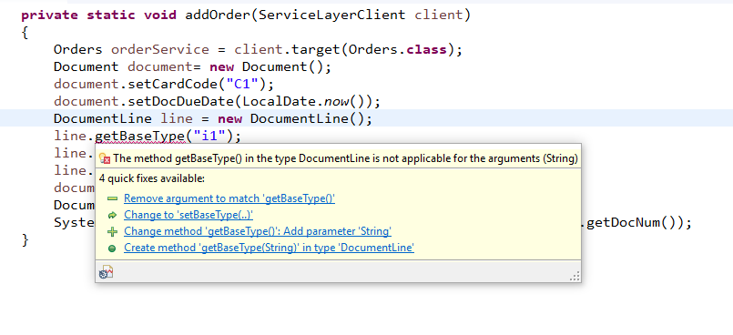
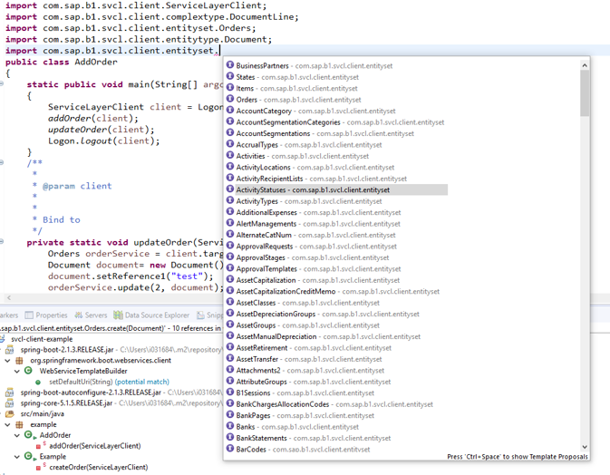
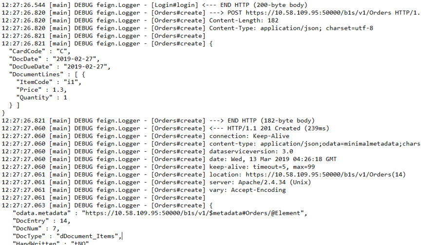

# SAP Business One Service Layer SDK

Business One Service Layer SDK make it easy to access SAP Business One Service Layer OData interface.

## Introduction. 
Details are listed in https://github.com/SAP/SAP-Business-One-Service-Layer-SDK/tree/master/readme

1. **Strong typed, detection of errors speeds development**

1. **Content assist intelligent code recommander & completion**

1. **Logger shows what happening in detail**
    

## Examples

1. **Login & Logout**

    Usage typically looks like this, an adaptation of the canonical Retrofit sample.
    ```java
    public class Logon 
    {
        static public void main(String[] argc) throws Exception 
        {
            ServiceLayerClient client = login();
            logout(client);
        }
    
    
        public static void logout(ServiceLayerClient client) 
        {
            Logout logout = client.target(Logout.class);
            logout.logout();		
        }
    
    
        public static ServiceLayerClient login() throws Exception
        {
            ServiceLayerClient client = ServiceLayerClient.inSecureClient("https://xxx.xxx.xxx.xxx:50000/b1s/v1");
            Login login = client.target(Login.class);
            Login.LoginParam param = new Login.LoginParam();
            param.setCompanyDB("SBODEMOUS");
            param.setUserName("manager");
            param.setPassword("******");
            login.login(param);	
            return client;
        }
    }

    ```
1. **Create Order**

    ```java
    public class AddOrder 
    {
        static public void main(String[] argc) throws Exception 
        {
            ServiceLayerClient client = Logon.login();
            addOrder(client);
            updateOrder(client);
            Logon.logout(client);
        }
        private static void updateOrder(ServiceLayerClient client) {
            Orders orderService = client.target(Orders.class);
            Document document= new Document();
            document.setReference1("test");
            orderService.update(2, document);
        }
        private static void addOrder(ServiceLayerClient client) 
        {
            Orders orderService = client.target(Orders.class);
            Document document= new Document();
            document.setCardCode("C");
            document.setDocDate(LocalDate.now());
            document.setDocDueDate(LocalDate.now());
            DocumentLine line = new DocumentLine();
            line.setItemCode("i1");
            line.setQuantity(BigDecimal.valueOf(1));
            line.setPrice(BigDecimal.valueOf(1.3));
            document.getDocumentLines().add(line);
            Document docCreated = orderService.create(document);
            System.out.println("Document created with Number :" + docCreated.getDocNum());		
        }
        
    }
    ```
